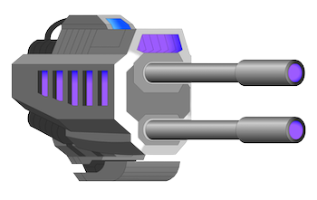

# Dimensional Defender

## Arcade-Style Space Shooter Game

Become the Dimensional Defender! Evil UFO forces have breached our dimension 
and are bent on invading Earth!  

The invading alien spacecraft have proven far too advanced for our fledgling space
defense systems.

In a last ditch effort to survive, humanity has united to manufacture a single, devastating 
weapon capable of penetrating the previously impervious UFO forcefields and destroying them 
in one hit!  They dubbed this weapon the "Big Bang" and attached it to our 
fastest, most technologically advanced spacefighter jet.

Then started the search ... the search for the mentally-strongest, smartest, most capable 
pilot on the planet Earth.  

You are that pilot.  

YOU, equipped with the overwhelmingly powerful "Big Bang" laser cannon, are the only force capable of guarding the good people of planet Earth from the invading force of aliens that 
have breached our dimension.

Hope for the future of humanity rests on your shoulders!  

Game Controls

Left Arrow - Moves the players spaceship to the left

Right Arrow - Moves the players spaceship to the right

SpaceBar - Shoot laser projectile at enemy UFO spaceships

Quit - Hit 'x' button in top-right corner of play window

